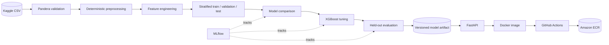
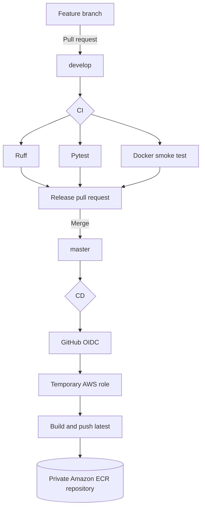

<div align="center">

# Bank Marketing ML Platform

### End-to-end ML pipeline from Kaggle data to a containerized FastAPI inference service

[](https://github.com/maha-meihemid/bank-marketing-ml-platform/actions/workflows/ci.yml)
[](https://github.com/maha-meihemid/bank-marketing-ml-platform/actions/workflows/cd.yml)


**Machine learning system for predicting term-deposit subscriptions from bank marketing campaign data.**

</div>

---

## Project overview

This project is based on Kaggle's [Playground Series - Season 5, Episode 8: Binary Classification with a Bank Dataset](https://www.kaggle.com/competitions/playground-series-s5e8/overview), which ran from July 31 to August 31, 2025 and is now closed.

The objective is to predict the probability that a bank client will subscribe to a **term deposit** after a marketing campaign. Each observation describes the client and the campaign interaction through features such as age, job, balance, housing and personal loans, contact type, previous campaign history and call duration. The target `y` is binary: whether the client subscribed or not.

The competition uses **ROC-AUC** as its evaluation metric. ROC-AUC evaluates how well the model ranks positive examples above negative ones across all possible classification thresholds. This is particularly useful here because only about **12.1%** of the labelled observations belong to the positive class, making accuracy alone potentially misleading. The model therefore outputs a subscription probability, while the API also exposes a binary prediction using a configurable decision threshold.

The repository implements the complete workflow around this prediction problem:

- ingest and validate the raw competition data;
- build deterministic preprocessing and feature pipelines;
- compare Logistic Regression, Random Forest and XGBoost;
- track experiments with MLflow;
- tune and evaluate the selected model on a held-out test set;
- serve the validated artifact through FastAPI;
- package the API as a non-root Docker container;
- verify code, tests and the running container in CI;
- publish the production image to Amazon ECR through keyless GitHub OIDC authentication.

## System overview



## Results

The labelled dataset contains **750,000 observations**, with approximately **12.1% positive examples**. The tuned XGBoost pipeline was evaluated once on a held-out test set of 112,500 rows.

| Metric | Final test result |
|---|---:|
| ROC-AUC | **0.9671** |
| PR-AUC | **0.8003** |
| Precision | **0.7620** |
| Recall | **0.6660** |
| F1 | **0.7108** |

The full experimental comparison, selected hyperparameters and limitations are documented in [MODEL_CARD.md](MODEL_CARD.md).

> [!IMPORTANT]
> `duration` is the current call duration and is only known after the marketing call. This project follows the Kaggle competition setting; it must not be presented as a pre-contact customer-targeting model. A real targeting system should retrain without this feature.

## Quick local demo with Docker

The validated model artifact is included in the repository, so the inference API can be tested locally without downloading the dataset or retraining the model.

### Requirements

- Git
- Docker Desktop with the Docker engine running

### 1. Clone the project

```bash
git clone https://github.com/maha-meihemid/bank-marketing-ml-platform.git
cd bank-marketing-ml-platform
```

### 2. Build the inference image

```bash
docker build -t bank-marketing-api .
```

### 3. Start the API

```bash
docker run --rm --name bank-marketing-api -p 8000:8000 bank-marketing-api
```

Keep this terminal open. The API is now available at:

- interactive Swagger UI: <http://localhost:8000/docs>
- health check: <http://localhost:8000/health>
- OpenAPI schema: <http://localhost:8000/openapi.json>

### 4. Test a prediction from Git Bash

Open a second Git Bash terminal and run:

```bash
curl --request POST "http://localhost:8000/predict" \
  --header "Content-Type: application/json" \
  --data '{
    "age": 42,
    "job": "management",
    "marital": "married",
    "education": "tertiary",
    "default": "no",
    "balance": 1850,
    "housing": "yes",
    "loan": "no",
    "contact": "cellular",
    "day": 15,
    "month": "may",
    "duration": 320,
    "campaign": 2,
    "pdays": -1,
    "previous": 0,
    "poutcome": "unknown"
  }'
```

The API returns this structure:

```json
{
  "prediction": 0,
  "subscription_probability": 0.10833550244569778,
  "threshold": 0.5
}
```

This response was produced by the versioned model artifact for the payload above. `prediction` is `1` when the probability is greater than or equal to the `0.5` threshold.

### 5. Stop the API

Press `Ctrl+C` in the terminal running Docker. Because the container uses `--rm`, Docker removes it automatically after it stops.

## Run the API directly with Python

Use this option when developing the FastAPI application without Docker.

```bash
python -m venv .venv
source .venv/Scripts/activate
python -m pip install --upgrade pip
python -m pip install -r requirements-api.txt
uvicorn bankmarketing.api.main:app --app-dir src --reload --port 8000
```

On macOS or Linux, activate the environment with `source .venv/bin/activate` instead.

## Reproduce the complete ML pipeline

The complete pipeline can also be reproduced from the raw Kaggle competition data. Training and tuning are kept separate from the inference demo because they require additional dependencies and compute.

### 1. Prepare the environment

```bash
python -m venv .venv
source .venv/Scripts/activate
python -m pip install --upgrade pip
python -m pip install -r requirements.txt
export PYTHONPATH=src
```

On PowerShell, replace the activation and final export commands with:

```powershell
.venv\Scripts\Activate.ps1
$env:PYTHONPATH = "src"
```

### 2. Configure Kaggle access

1. Open the archived [Kaggle competition page](https://www.kaggle.com/competitions/playground-series-s5e8/overview) and accept the competition rules if Kaggle requests it before allowing data access.
2. Create a Kaggle API token from your Kaggle account settings.
3. Place the downloaded `kaggle.json` file in `~/.kaggle/kaggle.json`.
4. Never commit that credential to Git.

Confirm that authentication works:

```bash
kaggle competitions files -c playground-series-s5e8
```

### 3. Execute every pipeline stage

Run the commands from the repository root and in this order:

```bash
# Download train.csv, test.csv and sample_submission.csv
python -m bankmarketing.data.ingest

# Validate raw schemas and business constraints with Pandera
python -m bankmarketing.data.validate

# Normalize raw values and write Parquet datasets
python -m bankmarketing.data.preprocess --force

# Create engineered features and stratified internal splits
python -m bankmarketing.features.build_features --force

# Compare three model families on raw and engineered features
python -m bankmarketing.training.train

# Tune the selected XGBoost pipeline
python -m bankmarketing.training.tune

# Evaluate once on the held-out test set and promote the final artifact
python -m bankmarketing.evaluation.evaluate
```

The final validated model is written to:

```text
artifacts/bank_marketing_model.joblib
```

Use `--force` with ingestion if the raw Kaggle files must also be downloaded again:

```bash
python -m bankmarketing.data.ingest --force
```

### 4. Inspect MLflow experiments

Training, tuning and evaluation runs are stored locally in `mlflow.db` and `mlruns/`.

```bash
mlflow ui --backend-store-uri sqlite:///mlflow.db --port 5000
```

Open <http://localhost:5000> to compare parameters, metrics and artifacts.

## Quality checks

Run the same Python checks used by CI:

```bash
ruff check .
pytest -q
```

Run the complete Docker build and API smoke test from Git Bash:

```bash
bash scripts/ci/docker_smoke_test.sh
```

The smoke test builds the image, starts a temporary container, checks `/health`, sends a real request to `/predict`, and removes the container afterward.

## CI/CD design



- **CI** runs on pull requests and pushes to `develop` and `master`.
- **CD** runs only after a push to `master`, which represents a validated release.
- GitHub Actions authenticates to AWS with **OIDC**. No long-lived AWS access key is stored in GitHub.
- The current delivery target is a private **Amazon ECR** repository tagged `latest`.
- ECR stores the deployable image; it does not by itself expose a public API URL.

Repository variables used by the CD workflow:

| Variable | Purpose |
|---|---|
| `AWS_REGION` | AWS region containing the ECR repository |
| `AWS_ROLE_ARN` | IAM role assumed by GitHub Actions through OIDC |
| `ECR_REPOSITORY` | Target private ECR repository name |

## Project structure

```text
.
|-- .github/workflows/       # CI and ECR delivery workflows
|-- artifacts/               # Validated inference model
|-- configs/                 # Data, split, model and tuning configuration
|-- data/                    # Raw, processed and feature datasets (ignored)
|-- scripts/ci/              # Reusable Docker smoke test
|-- src/bankmarketing/
|   |-- api/                 # FastAPI schemas, service and routes
|   |-- data/                # Ingestion, validation and preprocessing
|   |-- evaluation/          # Final held-out evaluation
|   |-- features/            # Feature engineering and data splitting
|   `-- training/            # Baselines, metrics and tuning
|-- tests/                   # Unit and integration tests
|-- Dockerfile
|-- MODEL_CARD.md
`-- README.md
```

## Engineering decisions

- **Reproducible splits:** stratified train, validation and test partitions use a fixed random seed.
- **No test-set leakage:** model selection and tuning use training/validation data; final evaluation uses the held-out test set once.
- **One inference contract:** the API reuses the same feature-building logic as training.
- **Portable artifact:** preprocessing and XGBoost are persisted together as a complete sklearn pipeline.
- **Small production image:** the Docker image installs only `requirements-api.txt`, not training tooling.
- **Non-root runtime:** the API process runs as an unprivileged container user.
- **Keyless AWS access:** GitHub OIDC replaces stored AWS access keys.

## License

This project is available under the [MIT License](LICENSE).
